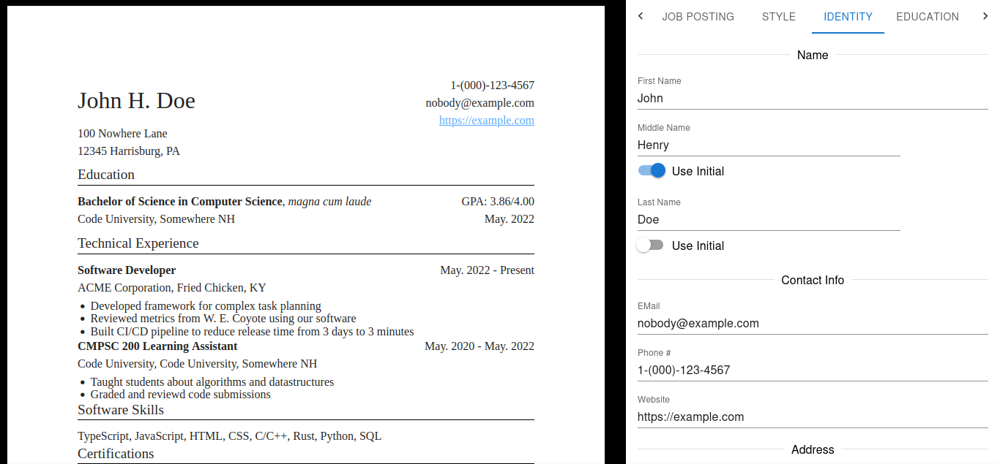

# Make Resume
Make Resume is a Desktop application that provides a unified editor to tailor resumes for job postings. 

It is written in TypeScript and built on top of the [Tauri](https://tauri.app/) app framework. It also makes use of React, MobX, and Material UI.

I built Make Resume to teach myself TypeScript, UI/UX programming/design, and to expose myself to the front end world.



## Building
Make Resume is built using Tauri and Yarn.

To use Tauri, you will need Rust installed.

To compile during development, run the following commands:
```bash
# 1. Install dependencies
yarn install

# 2. (optional) Run this so that VS Code's autocomplete works with Yarn berry:
yarn dlx @yarnpkg/sdks vscode

# 3. Compile the application and launch the development server
yarn run tauri dev
```
